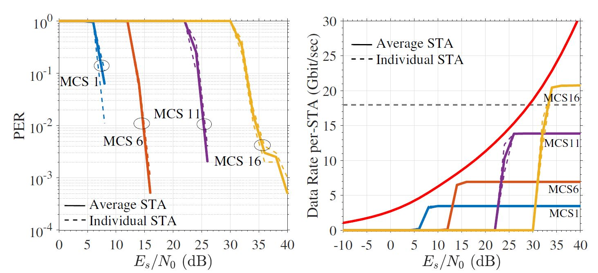

# Integrated Sensing and Communication Physical Layer Model (ISAC-PLM)
> Integrated Sensing and Communication Physical layer (PHY) model of IEEE 802.11ay/bf.

## Table of Contents
* [Features](#features)
* [Installation](#installation)
* [Requirements](#requirements)
* [How to Run](#how-to-run)
    * [Documentation](#documentation)
* [Examples Provided](#examples-provided)
* [References](#references)
* [Contributing](#contributing)
* [Contact information](#contact-information)
* [Credits](#credits)
* [License](#license)

## Features
* Support for IEEE 802.11ay including Single Carrier/OFDM waveform generation and spatial multiplexing schemes: SU-SISO, SU-MIMO, MU-MIMO.
* Comprehensive performance analysis tools: link-level BER, PER, data rate testing, and analytical SE bounds.
* Receiver algorithms for synchronization, channel estimation, carrier frequency offset (CFO) correction.
* Integrated sensing capabilities using both passive and active techniques.
* Sensing signal processing algorithms for clutter removal, 2D-CFAR, doppler processing, target detection, and range/velocity estimation.
* Sensing accuracy evaluated using Mean Squared Error (MSE) and Normalized Mean Squared Error (NMSE).

## Installation
Downloading or cloning the repository is all that's required—no further installation steps needed.

## Requirements
* The software is developed in MATLAB and tested on MATLAB R2023b.
* Requires the [MATLAB WLAN toolbox](https://www.mathworks.com/products/wlan.html).

## How to Run
* Navigate to `main.m`, and modify the variable `scenarioNameStr` to match the name of your desired scenario folder `scenarioFolder` within `.\examples`.
* Run `main.m` 

### Documentation
Extensive documentation is provided in [docs/isac-plm.pdf](docs/isac-plm.pdf), detailing ISAC-PLM's architecture, functionalities, and usage guidelines.

## Examples Provided
A collection of predefined examples demonstrating various configurations and scenarios is available in `/src/examples/` . 
The table below outlines the predefined examples along with their key configuration parameters:

| Example      | Number of Rx | Streams/rx | Channel Model | Precoder |   Packet 	   |
| :---         |     :---:    |   :---:    | :---: 		   |:---:     |  :---: 	       |
| sisoOfdmAwgn_data  | 1			  | 	1	   | AWGN 	   | - 		  | 	PSDU  	   |
| sisoSc_data  | 1			  | 	1	   | Rayleigh 	   | - 		  |  	PSDU  	   |
| sisoOfdm_data| 1            | 	1	   | Rayleigh 	   | - 		  |  PSDU 	   |
| sisoSc	   | 1			  | 	1	   | Rayleigh 	   | - 		  |  PPDU  	   |
| sisoOfdm     | 1            | 	1	   | Rayleigh 	   | - 		  |   PPDU 	   |
| mimoSc_data  | 1			  | 	2	   | Rayleigh 	   | RZF (Freq flat)	  |  	PSDU  	   |
| mimoOfdm_data| 1            | 	2	   | Rayleigh 	   | RZF (Freq sel) 		  |   PSDU 	   |
| mimoSc	   | 1			  | 	2	   | Rayleigh 	   | RZF (Freq flat) 		  |  	PPDU  	   |
| mimoOfdm     | 1            | 	2	   | Rayleigh 	   | RZF (Freq sel) 		  |   PPDU 	   |
| muMimoSc_data   | 2            | 	2	   | Rayleigh 	   | ZF (Time domain) 		  |    PSDU 	   |
| muMimoOfdm_data   | 2            | 	2	   | Rayleigh 	   | RZF (Freq sel) 		  |    PSDU 	   |
| muMimoOfdm   | 2            | 	2	   | Rayleigh 	   | RZF (Freq sel) 		  |    PPDU 	   |
| pointTargetPassiveSensing   | 1            | 	1	   | NIST QD 	   | - 		  |     PPDU 	   |
| singleHumanTarget   | 1            | 	1	   | NIST QD 	   | - 		  |    PPDU 	   |
| pointTargetActiveSensing   | 1            | 	1	   | NIST QD 	   | - 		  |    TRN-R	   |
| bistaticLivingRoomTRN-R| 1            | 	1	   | NIST QD 	   | - 		  |    TRN-R	   |
| bistaticLivingRoomTRN-T| 1            | 	1	   | NIST QD 	   | - 		  |    TRN-T	   |
| bistaticLivingRoomBeacon| 1            | 	1	   | NIST QD 	   | - 		  |    Beacon   |
| thresholdSensing	| 1            | 	1	   | NIST QD 	   | - 	|   PPDU 	   |
| vitalSignSensing	| 1            | 	1	   | NIST Measurements 	   | - 	|   TRN-R 	   |

## References

- S. Blandino, et al, [Low Overhead DMG Sensing for Vital Signs Detection](), 2024 IEEE International Conference on Acoustics, Speech and Signal Processing (ICASSP).
- S. Blandino, T. Ropitault, C. R. C. M. da Silva, A. Sahoo and N. Golmie, [IEEE 802.11bf DMG Sensing: Enabling High-Resolution mmWave Wi-Fi Sensing](https://ieeexplore.ieee.org/document/10018014), 2023 IEEE Open Journal of Vehicular Technology.
- N. Varshney et al., [Adaptive Channel-State-Information Feedback in Integrated Sensing and Communication Systems](https://ieeexplore.ieee.org/stamp/stamp.jsp?tp=&arnumber=10232381), 2023 IEEE Internet of Things Journal.
- J. Zhang, S. Blandino, N. Varshney, J. Wang, C. Gentile and N. Golmie, [Multi-User MIMO Enabled Virtual Reality in IEEE 802.11ay WLAN](https://ieeexplore.ieee.org/document/9771778), 2022 IEEE Wireless Communication and Networking Conference.
- S. Blandino, T.Ropitault, A. Sahoo and N. Golmie, [Tools, Models and Dataset for IEEE 802.11ay
 CSI-based Sensing](https://ieeexplore.ieee.org/document/9771569), 2022 IEEE Wireless Communication and Networking Conference.

### IEEE 802.11bf contributions

- [DMG/EDMG Link Level Simulation Platform](https://mentor.ieee.org/802.11/dcn/22/11-22-0803-00-00bf-dmg-edmg-link-level-simulation-platform.pptx)
- [Implementation of 60 GHz WLAN-SENS Physical Layer Model](https://mentor.ieee.org/802.11/dcn/22/11-22-1217-01-00bf-implementation-of-60-ghz-wlan-sens-physical-layer-model.docx)
- [TGbf Channel Models for WLAN Sensing Systems](https://mentor.ieee.org/802.11/dcn/21/11-21-0782-05-00bf-channel-models-for-wlan-sensing-systems.docx)
- [TGbf Evaluation Methodology and Simulation Scenarios](https://mentor.ieee.org/802.11/dcn/21/11-21-0876-05-00bf-11bf-evaluation-methodology-and-simulation-scenarios.doc)

## Contributing
We welcome feedback and contributions! Please reach out to the repository administrator for collaboration or queries.

## Contact information
[Steve Blandino](https://www.nist.gov/people/steve-blandino), NIST Communications Technology Laboratory, steveblandino@nist.gov .

## Credits
Special thanks to our contributors:
- [Steve Blandino](https://www.nist.gov/people/steve-blandino) 
- [Neeraj Varshney](https://www.nist.gov/people/neeraj-varshney)
- [Jian Wang](https://www.nist.gov/people/jian-wang) 
- Jiayi Zhang

## Cite

If you use ISAC-PLM in your reseach, please see [CITATION.cff](CITATION.cff) and cite it as follows:

NIST Communications Technology Laboratory, Integrated Sensing and Communication Physical Layer Model (ISAC-PLM), [https://github.com/wigig-tools/isac-plm](https://github.com/wigig-tools/isac-plm).

## License
Please refer to the [NIST-License.md](license/NIST-License.md) and [MathWorks-Limited-License.md](license/MathWorks-Limited-License.md) files in the `license` folder for more information.
